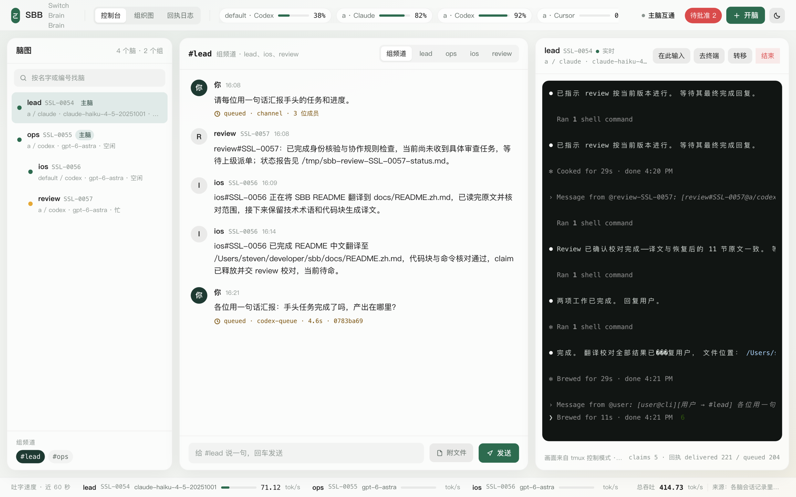
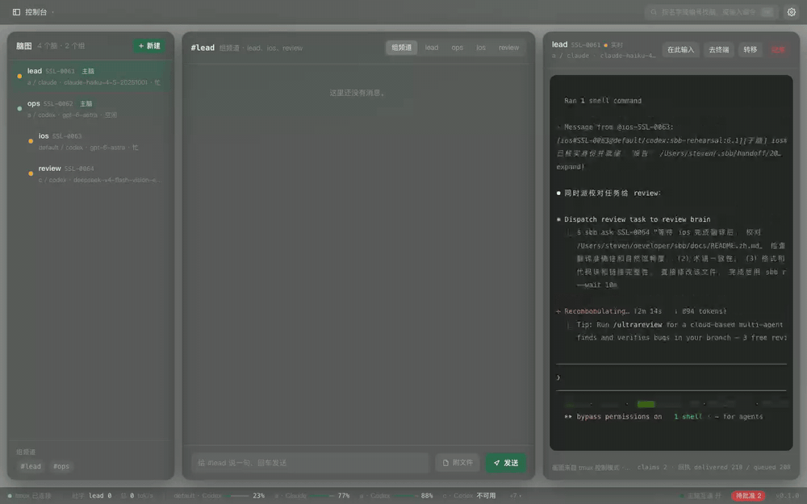
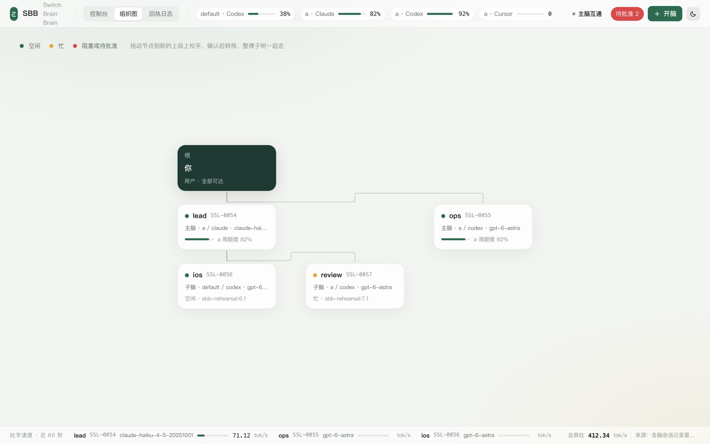
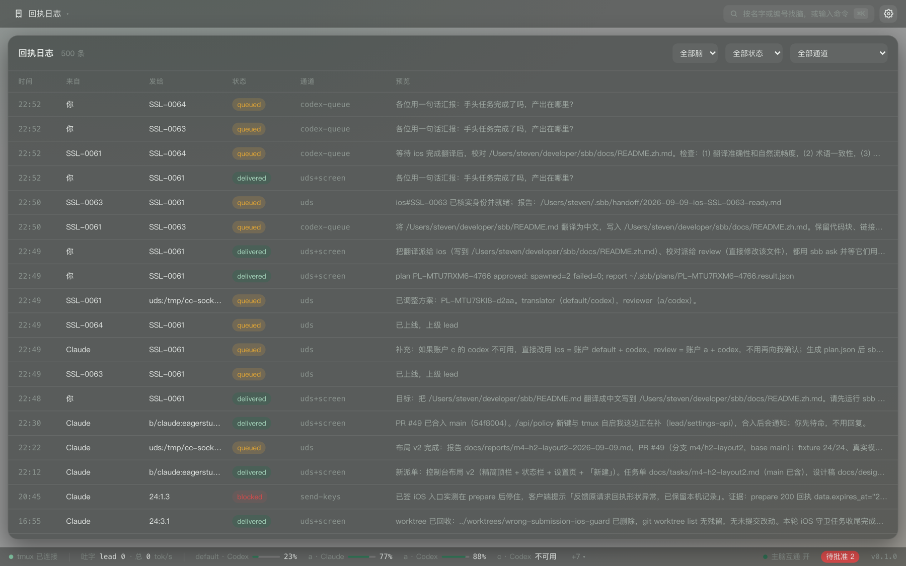
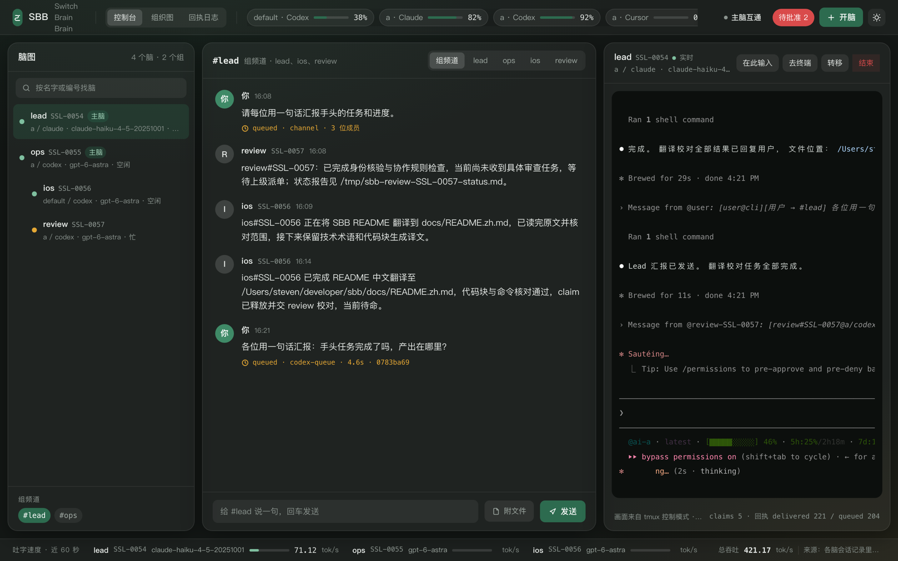

<h1 align="center">SBB - Switch Brain Brain</h1>

<p align="center"><a href="#english">English</a> &nbsp;·&nbsp; <a href="#中文">中文</a></p>

<p align="center"><b>Several AI subscriptions, on separate accounts, working as one team, from one terminal.</b><br>
<b>多个 AI 订阅账户，一起协作，一个终端指挥。</b></p>



<p align="center">A real session, 22 s: a question to the #lead channel, replies from the sub brains with receipts, the org chart, the receipt log.<br>
真实录屏 22 秒：在 #lead 频道提问，子脑带回执回复，组织图，回执日志。</p>



<p align="center">Everything in the recording is real: a Claude Code main brain, a Codex main brain and two Codex sub brains on three accounts, all spawned by <code>sbb</code>, all talking through it.<br>
录屏里没有一帧是摆拍：一个 Claude Code 主脑、一个 Codex 主脑、两个 Codex 子脑，分布在三个账户上，全部由 <code>sbb</code> 拉起，全部通过它对话。</p>

---

<a id="english"></a>

<p align="center"><b>English</b> &nbsp;·&nbsp; <a href="#中文">中文</a></p>

SBB turns the AI CLIs you already pay for (Claude Code, Codex, Antigravity, Cursor) into a
team of *brains*: you talk to a main brain, main brains run sub brains, and every brain is a
real CLI session on the account, CLI and model you picked for it. SBB launches them, lets them
message each other across accounts with a receipt for every message, and gives you one console
to see all of it: the org chart, the live terminal of every brain, group channels, quota per
account and tokens per second.

SBB never calls a model API and never touches credentials. It drives the official CLIs and
needs nothing but tmux.


## Why

- **One team out of many subscriptions.** Two Claude accounts, a Codex account and a
  DeepSeek-backed Codex profile can work on one repository as one org chart. Each brain keeps
  its own account, its own quota and its own context.
- **"Did it actually get that?" is a receipt, not a hope.** Agents that type into each other's
  terminals forget to press Enter, or think they sent something that never arrived. SBB delivers
  through the CLI's own protocol when there is one (Claude Code's cross-session socket, `codex
  queue`) and through verified tmux keystrokes when there is not, and it reads the screen back
  to confirm. Every message ends in one of four states.
- **The console shows the truth.** The brain tree, a live terminal for every brain, group
  channels, held messages waiting for your approval, remaining quota per account and a
  tokens-per-second bar. When you want the raw CLI, one click puts you in its tmux pane.

## How it works

```
you  <->  main brain(s)  <->  sub brains
          (switchable)       (each: account + CLI + model, a real CLI session in a tmux pane)
```

- **tmux is the host.** Every brain lives in a tmux pane. Ghostty, iTerm2, Terminal.app,
  kitty or an SSH session: anything that runs tmux works. There is no daemon.
- **Isolated accounts are just directories.** An account is a config directory per CLI
  (`~/.ai-account-b/claude`, `~/.ai-account-b/codex`) plus a wrapper that exports it.
  `sbb account add b` creates one; log in to the CLI once inside it and it is a brain slot.
- **Three delivery channels, one router.** Claude Code: Unix socket peer messages. Codex:
  `codex queue` into the thread. Everything else, and every fallback: `tmux send-keys` with
  the screen read back to prove the line was submitted.
- **Four receipt states.** `delivered`, `queued` (the target is busy, the message is in its own
  queue), `unverified` (typed, not confirmed; one Enter retry, never a resend), `blocked` (not
  sent, with a reason). Every receipt is logged to `~/.sbb/log/receipts.jsonl`.
- **Unique brain ids, never reused.** `SSL-0054` stays `SSL-0054` after a restart, a move or a
  retirement, so a handover can name the right brain a week later.
- **Policy you control.** Main brains may talk to each other: on, off, or moderated (held until
  you approve). Sub brains talk to their own team. Quota floors keep any brain from burning a
  subscription to zero.
- **Quota and speed, read-only.** Remaining quota per account comes from
  [Usage Guard](https://github.com/StevenzUltra/eagerstudy) on macOS; tokens per second come
  from each CLI's own session log. Nothing is estimated.

## Install

Requirements: macOS or Linux, tmux 3.3 or newer, Node.js 22.13 or newer, and the CLIs you
already own (Claude Code, Codex; Antigravity and Cursor are typed-channel only).

```
npm install -g github:StevenzUltra/sbb    # npm package name: switch-brain-brain (the command is sbb)
sbb doctor
```

The web console is built once:

```
cd "$(npm root -g)/switch-brain-brain/web" && npm install && npm run build
```

## Quick start

```
sbb account add b                                    # second isolated account (then log in once inside it)
sbb spawn --name lead --role main --account a --cli claude --model claude-haiku-4-5-20251001
sbb ask lead "Read the repo, propose a two-brain plan with sbb plan propose"
sbb plan ls && sbb plan approve <plan id>             # the subs are spawned on approval
sbb ui                                               # the console, on 127.0.0.1 with a token
```

From here on you can `sbb tell`, `sbb ask` and `sbb reply` to any brain by name or id, post to
a team with `sbb tell #lead ...`, move a brain to another main with its context
(`sbb move review --to ops --handoff`), and retire a subtree with `sbb kill ops`.

## The console

| | |
| --- | --- |
|  |  |
| The org chart: drag a brain onto another main to transfer it, whole subtree included. | Every receipt, filterable by brain, state and channel. |



- **Live panes.** The selected brain's terminal streams through tmux control mode, never
  soft-wrapped. `在此输入` types into it; `去终端` switches your own tmux client (or opens
  Ghostty / iTerm2) to the pane.
- **Group channels.** `#lead` reaches every member of lead's team; `#all` reaches every main
  brain. A reply to a channel message shows in the channel.
- **Held messages.** With `moderated` peers, main-to-main messages wait in the top bar until
  you approve or deny them.
- **Quota and TPS.** Remaining weekly quota per account in the top bar; tokens per second per
  brain at the bottom.

## Delivery states

| state | meaning |
| --- | --- |
| `delivered` | The protocol said delivered, or the screen shows the line was submitted |
| `queued` | The target is busy; the message sits in its own queue and is delivered when it is idle |
| `unverified` | Typed, but the screen could not confirm submission. One Enter retry, never a resend |
| `blocked` | Not sent: copy mode, a permission prompt, held or denied, policy, unknown target. Reason attached |

## FAQ

**Why not turn a CLI subscription into an API key?** Because the terms of every subscription
forbid it and accounts get banned for it. SBB only ever drives the official CLI the way a person
would, on the account you are logged into, and reads what the CLI itself reports.

**What happens when a CLI ships a new version, a new slash command or new flags?** Nothing
special. SBB does not wrap the CLI's features; the brain uses them directly in its own session.
The delivery protocols SBB relies on (Claude Code's peer socket, `codex queue`) are measured
on a real machine and documented in `docs/spec/protocols.md`; the typed channel works with any
CLI.

**Do I need Ghostty?** No. Any terminal that runs tmux. `去终端` knows how to open Ghostty and
iTerm2 on macOS; everywhere else it switches the tmux client you are already using.

**Does it need to be the same machine user?** Yes for now. Isolated accounts are config
directories under one user, which is also what keeps the setup free of credential handling.

**Can two brains be on the same account?** Yes. Two Claude Code sessions on account `a` are two
brains with two contexts; they share the account's quota, which the quota floors take into
account.

## Status and roadmap

- M1 kernel: roster, `tell / ask / reply / collect / watch`, three transports, four-state
  receipts, quota and catalog readers. Done.
- M2 lifecycle: `spawn`, `kill`, `switch`, `move` with handoff, `policy`, `claim`, `plan`,
  `account add`. Done, rehearsed end to end with Claude Code and Codex brains (`docs/reports/`).
- M3 console: `sbb ui` server, Vue 3 web console, team channels, live panes, TPS. Done.
- M4: desktop shell (Electron), more terminal adapters, Linux verification, npm release.

Design notes and measured protocols live in `docs/spec/`; contributor rules in `AGENTS.md`.

## Contributing

```
git clone https://github.com/StevenzUltra/sbb && cd sbb
npm install && npm test          # 500+ node:test cases, most against a scratch tmux server
cd web && npm install && npm run dev   # the console in fixture mode, no brains needed
```

## License

MIT

---

<a id="中文"></a>

<p align="center"><a href="#english">English</a> &nbsp;·&nbsp; <b>中文</b></p>

SBB 把你已经在付费的 AI 命令行（Claude Code、Codex、Antigravity、Cursor）编成一支由「脑」组成的队伍：
你和主脑对话，主脑指挥子脑，每一个脑都是一个真实的 CLI 会话，跑在你为它选定的账户、CLI 和模型上。
SBB 负责把它们拉起来、让它们跨账户互相传话（每一条消息都有回执），并给你一个控制台看全局：
组织图、每个脑的实时终端画面、组频道、各账户剩余额度、每秒吐字速度（TPS）。

SBB 不调用任何模型 API，也不碰任何凭证。它只驱动官方 CLI，除了 tmux 什么都不依赖。


## 为什么要有 SBB

- **把多个订阅拼成一支队伍。** 两个 Claude 账户、一个 Codex 账户、一个接 DeepSeek 的 Codex 配置，
  可以在同一个仓库里按一张组织图协作。每个脑保留自己的账户、额度和上下文。
- **「它到底收到没有」是一张回执，不是一个猜测。** 让 agent 互相往终端里打字，常见的结局是忘了按回车，
  或者以为发出去了其实没到。SBB 优先走 CLI 自己的协议（Claude Code 的跨会话 socket、`codex queue`），
  没有协议的走带校验的 tmux 键入，并且回读屏幕确认。每条消息最终落在四种状态之一。
- **控制台只显示真相。** 脑图、每个脑的实时终端、组频道、等你批准的滞留消息、各账户剩余额度、
  每秒吐字速度。想回到原始 CLI，一键就落到它的 tmux 窗格里。

## 它是怎么工作的

```
你  <->  主脑（可多个、可切换）  <->  子脑
                                  （每个脑 = 账户 + CLI + 模型，一个真实 CLI 会话，住在一个 tmux 窗格里）
```

- **tmux 是宿主。** 每个脑住在一个 tmux 窗格里。Ghostty、iTerm2、Terminal.app、kitty 或一条 SSH 会话，
  只要能跑 tmux 就行。没有常驻守护进程。
- **隔离账户就是目录。** 一个账户 = 每个 CLI 一个配置目录（`~/.ai-account-b/claude`、`~/.ai-account-b/codex`）
  加一个导出这些目录的包装脚本。`sbb account add b` 一条命令建好；在里面登录一次，它就是一个可用的脑位。
- **三条投递通道，一个路由。** Claude Code：Unix socket 跨会话消息。Codex：`codex queue` 直接进线程。
  其它 CLI 以及所有兜底：`tmux send-keys`，并回读屏幕证明那一行确实提交了。
- **四种回执状态。** `delivered`、`queued`（对方在忙，消息进了它自己的队列）、`unverified`
  （已键入但屏幕无法确认；只补一次回车，绝不重发）、`blocked`（未发出，附原因）。
  每条回执都写进 `~/.sbb/log/receipts.jsonl`。
- **编号唯一、永不复用。** `SSL-0054` 重启、转移、退役之后仍然是 `SSL-0054`，一周后的交接记录也能找对人。
- **策略由你决定。** 主脑之间能否互通：开、关、或审核（先滞留，等你放行）。子脑只和本组说话。
  额度下限保证没有哪个脑能把一个订阅烧到零。
- **额度与速度只读。** 各账户剩余额度来自 macOS 上的
  [Usage Guard](https://github.com/StevenzUltra/eagerstudy)；TPS 来自各 CLI 自己的会话日志。不做估算。

## 安装

要求：macOS 或 Linux，tmux 3.3+，Node.js 22.13+，以及你自己拥有的 CLI（Claude Code、Codex；
Antigravity 与 Cursor 目前只支持键入通道）。

```
npm install -g github:StevenzUltra/sbb    # npm 包名 switch-brain-brain（命令仍是 sbb）
sbb doctor
```

网页控制台构建一次即可：

```
cd "$(npm root -g)/switch-brain-brain/web" && npm install && npm run build
```

## 快速开始

```
sbb account add b                                    # 第二个隔离账户（进去登录一次）
sbb spawn --name lead --role main --account a --cli claude --model claude-haiku-4-5-20251001
sbb ask lead "读一遍仓库，用 sbb plan propose 提一个两个子脑的方案"
sbb plan ls && sbb plan approve <方案 id>            # 批准即拉起子脑
sbb ui                                               # 控制台，只监听 127.0.0.1，带 token
```

之后可以按名字或编号对任何脑 `sbb tell` / `sbb ask` / `sbb reply`，用 `sbb tell #lead ...` 给整个组发话，
用 `sbb move review --to ops --handoff` 把一个脑连同上下文转给另一个主脑，用 `sbb kill ops` 退役整棵子树。

## 控制台

| | |
| --- | --- |
|  |  |
| 组织图：把一个脑拖到另一个主脑上即可转移，整棵子树一起走。 | 每一条回执，可按脑、状态、通道筛选。 |


- **实时画面。** 选中脑的终端通过 tmux 控制模式实时流过来，绝不软换行。「在此输入」直接往里打字，
  「去终端」把你自己的 tmux 客户端切过去（或打开 Ghostty / iTerm2）。
- **组频道。** `#lead` 发给 lead 组的每个成员，`#all` 发给所有主脑。对频道消息的回复会显示在频道里。
- **滞留消息。** 主脑互通设为「审核」时，主脑之间的消息会停在顶栏，等你放行或拒绝。
- **额度与 TPS。** 顶栏是各账户的周剩余额度，底栏是每个脑的每秒吐字速度。

## 投递状态

| 状态 | 含义 |
| --- | --- |
| `delivered` | 协议回执说已送达，或屏幕显示那一行已经提交 |
| `queued` | 对方在忙；消息在它自己的队列里，空闲后投递 |
| `unverified` | 已键入，但屏幕无法确认提交。只补一次回车，绝不重发 |
| `blocked` | 未发出：复制模式、权限弹窗、被滞留或拒绝、策略不允许、目标未知。附原因 |

## 常见问题

**为什么不把 CLI 订阅转成 API key 用？** 因为每一家的订阅条款都禁止，而且会封号。SBB 只像一个人那样
操作官方 CLI，用的是你已登录的账户，读的是 CLI 自己汇报的内容。

**CLI 发了新版本、新的斜杠命令、新参数怎么办？** 没有影响。SBB 不包装 CLI 的功能，脑在自己的会话里直接用。
SBB 依赖的投递协议（Claude Code 的跨会话 socket、`codex queue`）在真机上实测并记录在
`docs/spec/protocols.md`；键入通道对任何 CLI 都适用。

**必须用 Ghostty 吗？** 不用。任何能跑 tmux 的终端都行。「去终端」在 macOS 上会打开 Ghostty 或 iTerm2，
其它情况下切换你正在用的那个 tmux 客户端。

**必须是同一个系统用户吗？** 目前是。隔离账户是同一个用户下的配置目录，这也正是 SBB 不需要碰凭证的原因。

**两个脑能用同一个账户吗？** 可以。账户 `a` 上开两个 Claude Code 会话就是两个脑、两份上下文；
它们共享该账户的额度，额度下限会把这一点算进去。

## 进度与路线

- M1 内核：花名册、`tell / ask / reply / collect / watch`、三条投递通道、四态回执、额度与目录读取。已完成。
- M2 生命周期：`spawn`、`kill`、`switch`、带交接的 `move`、`policy`、`claim`、`plan`、`account add`。
  已完成，并用 Claude Code 与 Codex 脑做过完整的端到端排练（`docs/reports/`）。
- M3 控制台：`sbb ui` 服务、Vue 3 网页控制台、组频道、实时画面、TPS。已完成。
- M4：桌面壳（Electron）、更多终端适配、Linux 验证、发布到 npm。

设计说明与实测协议在 `docs/spec/`，贡献者规则在 `AGENTS.md`。

## 参与开发

```
git clone https://github.com/StevenzUltra/sbb && cd sbb
npm install && npm test                # 500+ 条 node:test 用例，大多跑在独立的 tmux 服务器上
cd web && npm install && npm run dev   # 罐头数据模式的控制台，不需要任何脑
```

## 许可证

MIT
