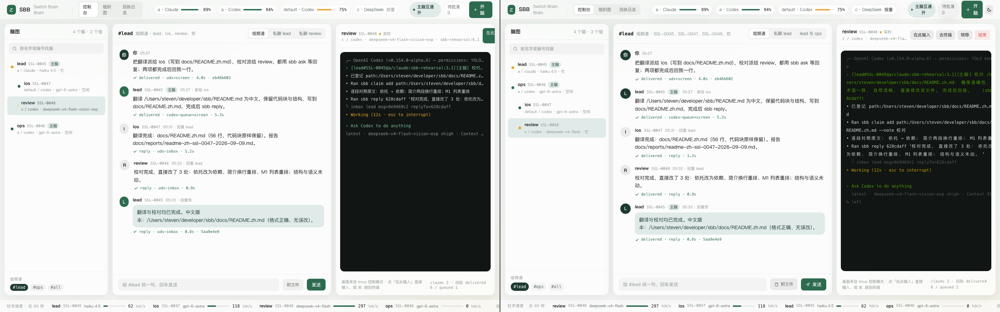
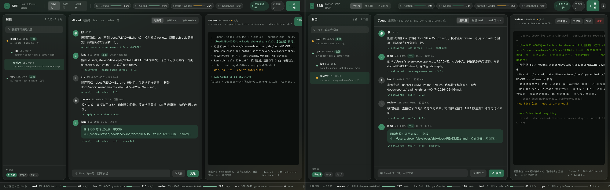
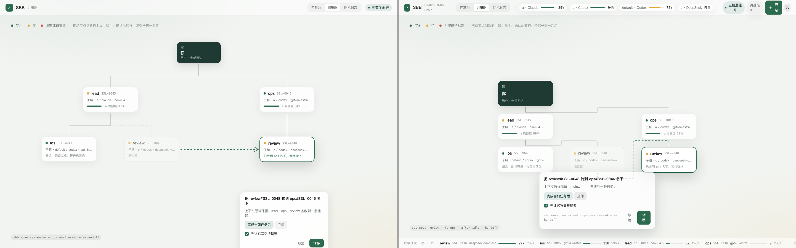
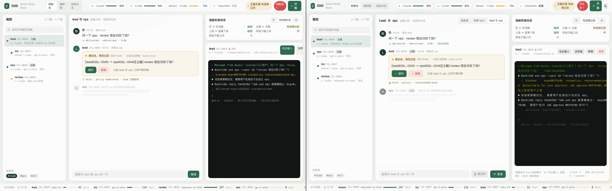

# h2 报告：M3 Web 控制台（Vue 3 + Vite + Tailwind v4）

- 分支：`m3/h2-web`（base `main`，起点 `a696f4f`）
- worktree：`~/developer/sbb-worktrees/h2`
- 日期：2026-09-09
- 任务单：`docs/tasks/m3-h2-web.md`；规范：`docs/spec/web-console.md`、`docs/spec/ui-server.md`
- 视觉基准：`docs/design/console/{Main,MainDark,Transfer,Held}.html` + `docs/design/tokens.css`

## 交付物

| 文件 | 内容 |
| --- | --- |
| `web/package.json`、`web/vite.config.js`、`web/index.html` | 独立包；依赖只有规范允许的 vue / pinia / @vue-flow/core / @xterm/xterm / @xterm/addon-fit + vite / @vitejs/plugin-vue / tailwindcss / @tailwindcss/vite |
| `web/src/main.js`、`web/src/style.css` | 挂载与主题引导；`@theme` 品牌 token、深浅两套表面变量、`.glass` / `.bar` / `.seg` / `.btn-primary` 等组件类 |
| `web/src/api/{index,http,fixture}.js` | `createClient()` 按 `VITE_SBB_FIXTURE` 分流；真机走 `GET /api/state` + SSE `/api/events` + 窗格 WebSocket，fixture 走本地 JSON，二者同一接口 |
| `web/src/store/sbb.js` | Pinia：快照 + 事件归并（brain / receipt / message / held / policy / claim / quota / tps / plan）、动作、快捷键 |
| `web/src/components/*.vue` | 13 个具名组件 + `App.vue`（TopBar、TpsBar、ToastStack、BrainTree、Composer、HeldCard、ConversationStream、BrainPane、PolicyCard、MoveConfirm、KillConfirm、SpawnDialog、ReceiptLog，组织图 OrgChart，容器 ConsoleView） |
| `web/fixtures/{state,events,panes,scenes}.json` | 四屏所需假状态、环境事件流、四个窗格的 ANSI 屏、`held` / `transfer` 场景叠加 |
| `test/web-build.test.js` | `npm run build` 产出 `web/dist/index.html`（`node_modules` 不存在时跳过） |
| `docs/reports/m3-h2-screens/` | 四状态 × 深浅 8 张截图、4 张与 mockup 的并排对照、1 段 23 秒演示视频 |

## 关键决定

1. **fixture 与真机同一接口**。`web/src/api/index.js` 只按 `import.meta.env.VITE_SBB_FIXTURE === '1'` 选实现，store 与组件不认识 fixture。h1 的 `sbb ui` 落地后，`VITE_SBB_FIXTURE` 不设即可切真机，无需改组件。
2. **四屏可达**。`?scene=held` / `?scene=transfer` 应用 `fixtures/scenes.json` 的叠加，`?view=console|org|log` 指定初始视图，截图与演示都靠这两个参数走到每个状态。
3. **主题**：默认跟随系统 `prefers-color-scheme`，手动切换写 `localStorage['sbb-theme']`，`.dark` 加在 `<html>`。规范只要求深浅两套视觉，没有规定开关，这里补了一个顶栏按钮。
4. **转移预览按 mockup**：拖动确认前，源脑在原位留一张虚线灰卡（“原位置”），目标名下出现一张实卡（“已收到 X 名下，等待确认”），两者之间一条绿色虚线；确认后树才真正重排。
5. **回执日志的数据源是缺口**（见下）：`/api/state` 没有回执列表字段，快照里放了一份 `receipts` 供 fixture 用，真机模式只能从连接后的 `receipt` 事件累积。

## 视觉对照（左：`docs/design/console/` mockup，右：fixture 实渲染，1440×900）

控制台（`Main.html` / 实渲染浅色）



深色（`MainDark.html`）



组织图转移（`Transfer.html`）



主脑互通过目（`Held.html`）



其余原图：`m3-h2-screens/{console,org,receipts,held}-{light,dark}.png`。

已知差异（都不影响交互）：

- 组织图页 mockup 用了简化顶栏（只有视图切换与策略），实现沿用统一顶栏（含额度 chip）。
- 左树顺序按快照数据；线程 tab 显示真实标题（`lead 与 ops`），mockup 写的是 `私聊 review`。
- 右栏窗格是 `fixtures/panes.json` 的罐头 ANSI，不是真实 tmux 屏。

## 演示视频

`docs/reports/m3-h2-screens/console-demo.webm`（23 秒，1440×900，fixture 模式实录，`?scene=held` 起始）：

开脑 `audit` → `#lead` 组频道派单（回执 `delivered`）→ `⌘Enter` 问子脑，1.6 秒后带回执回复 → 组织图把 `ios` 拖到 `ops` 名下并确认（`sbb move ios --to ops --after-idle --handoff`）→ 回到 `lead 与 ops` 线程放行被扣住的消息，消息回执从 `held` 变成 `delivered · policy+screen`。

录制脚本用机器上已有的 Playwright 1.60.0（`~/developer/eagerstudy/node_modules/.pnpm/...`），不写进仓库、不新增依赖。

## 验证（真实命令与输出）

```
$ npm --prefix web run build
✓ built in 1.53s   → web/dist/index.html + assets/index-*.{css,js}

$ npm test
ℹ tests 409   ℹ pass 409   ℹ fail 0
（含新增 `web: npm run build produces dist/index.html`）

$ node /tmp/shots.mjs          # Playwright 抓 4 状态 × 深浅
no console errors
```

四屏渲染无 console error、无 pageerror（截图与录像两轮各自断言）。

**本轮只在 fixture 模式验证**：h1 的 `sbb ui` 还没落地，没有真机 `GET /api/state`、SSE 与窗格 WebSocket 可打。真机路径按 `docs/spec/ui-server.md` 实现并有独立分支（401 → `unauthorized`、`?t=` 取 token 后写 cookie、WS 控制帧 `closed` / `refused`），但**未在真实服务上跑过**。

## 视觉核验中修掉的三个真问题

1. **拖拽永远落空**：`onDragStop` 先把 `dragSource` 置空，再算 `validTargets`，computed 重算后返回 `null`，任何一次拖动都走“拖到另一个脑上松手”的提示。改成先快照允许集合再清状态。
2. **放行后消息仍写着 `held`**：`message` 事件按 `msgId` 去重，已存在的消息不会被替换，于是回执行停在 `held · policy`。现在 `receipt` 事件会回填到同 `msgId` 的消息上。
3. **所有主按钮透明**：`.btn-primary` 引用 `var(--es-green)`，而 token 定义名是 `--color-es-green`，计算值无效 → 开脑 / 发送 / 放行 / 转移全部没有底色。同类未定义引用还有 `--es-muted` / `--es-dim` / `--es-dark-muted` / `--es-dark-text`，一并改成 `--color-es-*`（脚本复查 `still undefined: []`）。

## 与规范 / 任务单不一致或待补

1. **`GET /api/state` 缺回执列表**：回执日志屏在真机模式只能显示连接之后产生的回执。需要 h1 在快照里加 `receipts: [...]`（最近 N 条），前端已按 `state.receipts ?? []` 兼容。
2. **主题开关是新增**：规范未要求，任务单要求深浅两套像素对齐，加了持久化开关。
3. **fixture 里的 `receipts`、`scenes.json` 只服务演示**，不是契约。

## 跨端

本轮只新增 `web/` 独立包与 `test/web-build.test.js`，未改 API、共享契约、状态枚举或用户流程。

- Desktop：不适用（未动 `apps/`，也未动 renderer 消费链）
- Web：本任务即 Web 控制台
- Mobile：不适用

## 文件清单

```
web/                               新增（32 个文件，不含 node_modules / dist）
test/web-build.test.js             新增
docs/reports/m3-h2-2026-09-09.md   本报告
docs/reports/m3-h2-screens/        8 张截图 + 4 张对照 + 1 段视频
```
